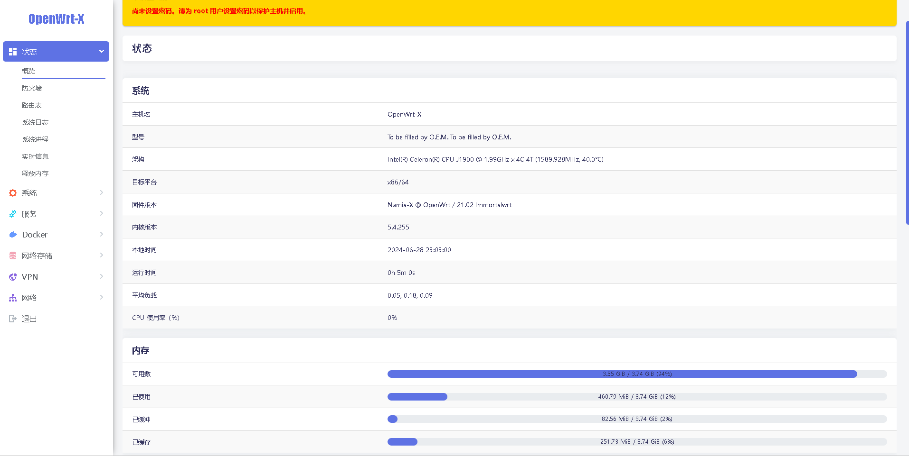
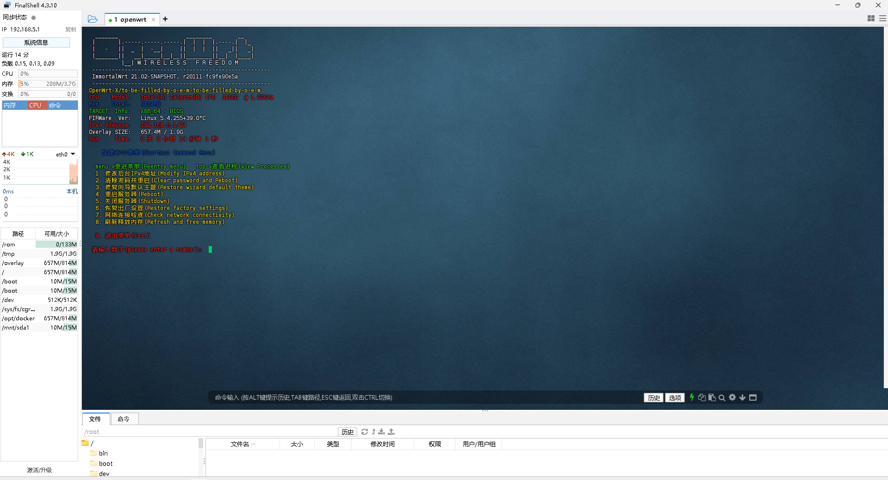

<p>
  <h1 align="center">
    <b>I'm <a href="https://t.me/RileyK9880">OpenWrt-X</a> 🎈</b>
[](https://t.me/RileyK9880)
[](mailto:kmy258855@gmail.com)
<p align="center">
  <a href="https://google.com">
    
  </a>
</p>

<p align="center" style="margin: -20px 0 30px">
   <a href="https://twitter.com/kenzo" target="_blank" style='margin-right:10px'>
    
  </a>
</p>
  <br />
   <small></small>
   <br />
   <br />
 </div>
 <br />

[](#readme) [](#项目说明-) [](#固件特色-) [](#固件下载-) [](#近期更新-) [](#插件预览-) [](#定制固件-) [](#特别提示-) [](#鸣谢-)
</div>

## 项目说明 [](#项目说明-)
- 项目使用 Github Actions 拉取Openwrt的源码如下。
-  [](https://github.com/coolsnowwolf/lede) [](https://github.com/immortalwrt/immortalwrt) [](https://github.com/Lienol/openwrt) [](https://github.com/openwrt/openwrt) [](https://github.com/x-wrt/x-wrt)
- 固件构成： [](https://github.com/P3TERX/Actions-OpenWrt) [](https://github.com/281677160/common) 
- 固件默认管理地址：`192.168.5.1` 默认用户：`root`密码：`【空】
- 项目编译的固件插件为最新版本，最新版插件可能有 BUG，如果之前使用稳定则无需追新
- 第一次使用请采用全新安装，避免出现升级失败以及其他一些可能的 BUG
- 支持uefi和传统启动两种模式，可以使用微pe或传统你们知道的刷机方式
- 另外就是网盘的固件可能更新的网站是我原始仓库-X的你们如果刷网盘固件并且要和我后台关联更新的话把Namia-X改成Namia-R
- 刷机工具 [`百度网盘💕`](https://pan.baidu.com/s/1k14RFEMdHw3W_S7wCnQyDg?pwd=8986) 提取码: 8986 
- 编译 [`必看项💕`](https://raw.githubusercontent.com/Namia-R/OpenWrt-X/refs/heads/main/backups/%E5%B7%B2%E7%BC%96%E8%AF%91%E8%AF%B4%E6%98%8E/txt) 

## 固件特色 [](#固件特色-)
1. 支持在线更新固件
2. x86集成部分常用有线、无线、3G / 4G 网卡驱动
3. 集成中文版 netdata 实时监控插件，小白也能轻松看懂系统概况
4. 集成 iStore 应用商店，可根据自己需求自由安装所需插件
5. 集成 Docker 服务，可在 OpenWrt 内自由部署 Docker 应用
6. 集成应用过滤插件，支持游戏、视频、聊天、下载等 APP 过滤
7. 集成在线用户插件，可查看所有在线用户 IP 地址与实时速率等

## 固件下载 [](#固件下载-)
点击下表中 [](https://github.com/Namia-R/OpenWrt-X/releases) 即可跳转到该设备固件下载页面
| 平台+设备名称 | 固件编译状态 | 配置文件 | 固件下载 |
| :-------------: | :-------------: | :-------------: | :-------------: |
| [](https://github.com/Namia-R/OpenWrt-X/blob/main/.github/workflows/Lede.yml) | [](https://github.com/Namia-R/OpenWrt-X/actions/workflows/Lede.yml) | [](https://github.com/Namia-R/OpenWrt-X/blob/main/build/Lede/seed/x86_64) | [](https://github.com/Namia-R/OpenWrt-X/releases/tag/Update-x86) |
| [](https://github.com/Namia-R/OpenWrt-X/blob/main/.github/workflows/Immortalwrt.yml) | [](https://github.com/Namia-R/OpenWrt-X/actions/workflows/Immortalwrt.yml) | [](https://github.com/Namia-R/OpenWrt-X/blob/main/build/Immortalwrt/seed/x86_64) | [](https://github.com/Namia-R/OpenWrt-X/releases/tag/Update-x86) |
| [](https://github.com/Namia-R/OpenWrt-X/blob/main/.github/workflows/Lienol.yml) | [](https://github.com/Namia-R/OpenWrt-X/actions/workflows/Lienol.yml) | [](https://github.com/Namia-R/OpenWrt-X/blob/main/build/Lienol/seed/x86_64) | [](https://github.com/Namia-R/OpenWrt-X/releases/tag/Update-x86) |
| [](https://github.com/Namia-R/OpenWrt-X/blob/main/.github/workflows/Official.yml) | [](https://github.com/Namia-R/OpenWrt-X/actions/workflows/Official.yml) | [](https://github.com/Namia-R/OpenWrt-X/blob/main/build/Official/seed/x86_64) | [](https://github.com/Namia-R/OpenWrt-X/releases/tag/Update-x86) |
| [](https://github.com/Namia-R/OpenWrt-X/blob/main/.github/workflows/Xwrt.yml) | [](https://github.com/Namia-R/OpenWrt-X/actions/workflows/Xwrt.yml) | [](https://github.com/Namia-R/OpenWrt-X/blob/main/build/Xwrt/seed/x86_64) | [](https://github.com/Namia-R/OpenWrt-X/releases/tag/Update-x86) |

### 近期更新 [](#近期更新-)
- ### 努力修复23.05编译基础配置……🤣

## 插件预览 [](#插件预览-)
- 
- 
</details>
<details>
<summary><b>&nbsp;X86 固件插件大概预览</b></summary>
<br/>
<details>
<summary><b>├── 状态</b></summary>
　├── 概况<br/>
　├── 防火墙<br/>
　├── 路由表<br/>
　├── 系统日志<br/>
　├── 内核日志<br/>
　├── 系统进程<br/>
　├── 实时信息<br/>
　├── 实时监控<br/>
　├── 在线用户<br/>
　├── WireGuard 状态<br/>
　├── 负载均衡<br/>
　└── 释放内存
</details>
<details>
<summary><b>├── 系统</b></summary>
　├── 系统<br/>
　├── 管理权<br/>
　├── TTYD 终端<br/>
　├── 软件包<br/>
　├── 启动项<br/>
　├── 计划任务<br/>
　├── 挂载点<br/>
　├── 磁盘管理<br/>
　├── 备份/升级<br/>
　├── 在线/更新<br/>
　├── 自定义命令<br/>
　├── 定时重启<br/>
　├── 文件传输<br/>
　├── Argon 主题设置<br/>
　├── 重启<br/>
　└── 关机
</details>
<details>
<summary><b>├── 服务</b></summary>
　├── PassWall<br/>
　├── PassWall2<br/>
　├── Hello World<br/>
　├── iKoolProxy 滤广告<br/>
　├── V2ray 服务器<br/>
　├── 广告屏蔽大师 Plus+<br/>
　├── ShadowSocksR Plus+<br/>
　├── AdGuard Home<br/>
　├── 应用过滤<br/>
　├── MosDNS<br/>
　├── 全能推送<br/>
　├── 微信推送<br/>
　├── 上网时间控制<br/>
　├── 解锁网易云灰色歌曲<br/>
　├── OpenClash<br/>
　├── 动态 DNS<br/>
　├── MultiSD_Lite<br/>
　├── SmartDNS<br/>
　├── 网络唤醒<br/>
　├── 迅雷快鸟<br/>
　├── Frps<br/>
　├── UU游戏加速器<br/>
　├── UPnP<br/>
　├── KMS 服务器<br/>
　├── AirPlay 2 音频接收<br/>
　├── udpxy<br/>
　├── Nps 内网穿透<br/>
　├── uHTTPd<br/>
　├── Frp 内网穿透<br/>
　└── MWAN3 分流助手
</details>
<details>
<summary><b>├── iStore</b></summary>
</details>
<details>
<summary><b>├── Docker</b></summary>
　├── 概览<br/>
　├── 容器<br/>
　├── 镜像<br/>
　├── 网络<br/>
　├── 存储卷<br/>
　├── 事件<br/>
　└── 设置
</details>
<details>
<summary><b>├── 网络存储</b></summary>
　├── 文件浏览器<br/>
　├── 可道云<br/>
　├── NFS 管理<br/>
　├── 微力同步<br/>
　├── Alist 文件列表<br/>
　├── qBittorrent<br/>
　├── USB 打印服务器<br/>
　├── 硬盘休眠<br/>
　├── 挂载 SMB 网络共享<br/>
　├── 网络共享<br/>
　├── FTP 服务器<br/>
　├── Rclone<br/>
　├── Aria2 配置<br/>
　├── miniDLNA<br/>
　└── Transmission
</details>
<details>
<summary><b>├── VPN</b></summary>
　├── N2N v2 VPN<br/>
　├── SoftEther VPN 服务器<br/>
　├── OpenVPN 服务器<br/>
　├── PPTP VPN 服务器<br/>
　├── IPSec VPN 服务器<br/>
　└── ZeroTier
</details>
<details>
<summary><b>├── 网络</b></summary>
　├── 接口<br/>
　├── DHCP/DNS<br/>
　├── 主机名<br/>
　├── IP/MAC 绑定<br/>
　├── 静态路由<br/>
　├── 防火墙<br/>
　├── 诊断<br/>
　├── Socat<br/>
　├── SQM QoS<br/>
　├── 网速控制<br/>
　├── 多线多拨<br/>
　├── 负载均衡<br/>
　└── Turbo ACC 网络加速
</details>
<details>
<summary><b>├── 带宽监控</b></summary>
　├── 显示<br/>
　├── 配置<br/>
　├── 备份<br/>
　├── 网速监控<br/>
　└── 实时流量监测
</details>
　└── <b>退出</b>
</details>


## 定制固件 [](#定制固件-)
1. 首先要登录 Gihub 账号，然后 Fork 此项目到你自己的 Github 仓库，复刻[`必看项！！！💕`](https://github.com/Namia-R/OpenWrt-X/blob/main/backups/%E5%B7%B2%E7%BC%96%E8%AF%91%E8%AF%B4%E6%98%8E/txt)
2. REPO_TOKEN密匙制作教程：https://git.io/jm.md 云编译需要 [在此](https://github.com/settings/tokens) 创建个```token```,勾选：```repo```, ```workflow```，保存所得的key【后面两种随意】
- 然后在此仓库```Settings```->```Secrets```中添加个名字为```REPO_TOKEN```的Secret,填入token获得的key

- TG通知```Settings```->```Secrets```中添加个名字为```TELEGRAM_BOT_TOKEN```和```TELEGRAM_CHAT_ID```
3. 插件对应名称及功能请参考恩山网友帖子：[Applications 添加插件应用说明](https://www.right.com.cn/forum/thread-3682029-1-1.html) 不完全看我后面加啥随心
4. 如需修改默认 IP、添加一些其他设置请在 `【xxx】diy-part.sh` 文件内修改，已经大众化了
5. 点击 `Actions` 运行要编译的 `workflow`去选取是否需要SSH链接如果不需要直接开始编译
- 如果需要ssh，点打开，最后点击运行程序就可以了
- 在运行过程中会出现ssh链接网址点击它就会打开另外一个网址
- 开始 ctrl+C 结束 ctrl+D
- 进ssh选择插件
- 进入CD命令
-     cd openwrt && make menuconfig
6. 编译大概需要1-3小时，一般两个半小时就编译完成，最后后在仓库主页 [Releases](https://github.com/Namia-R/OpenWrt-X/releases) 对应 Tag 标签内下载固件
<details>

   **如果看不懂编译界面可以参考 YouTube 视频：[软路由固件 OpenWrt 编译界面设置](https://www.youtube.com/watch?v=jEE_J6-4E3Y&list=WL&index=7)**
</details>

## 特别提示 [](#特别提示-)

- ### 最后就是所有的固件是基于本人有什么设备而去编译的而不是大众化，有啥做的不好的自行谅解！邮箱和T G联系
- **因精力有限不提供任何技术支持和教程等相关问题解答，不保证完全无 BUG！**

[](https://starchart.cc/Namia-R/OpenWrt-X)

## 鸣谢 [](#鸣谢-)
| [ImmortalWrt](https://github.com/immortalwrt) | [coolsnowwolf](https://github.com/coolsnowwolf) | [Lienol](https://github.com/Lienol/openwrt) | [OpenWrt](https://github.com/openwrt/openwrt) | [P3TERX](https://github.com/P3TERX) | [Xwrt](https://github.com/x-wrt/x-wrt) | [281677160](https://github.com/281677160/bendi) |
| :-------------: | :-------------: | :-------------: | :-------------: | :-------------: | :-------------: | :-------------: |
|  |  |  |  |  |  |  |

<a href="#readme">

</a>
